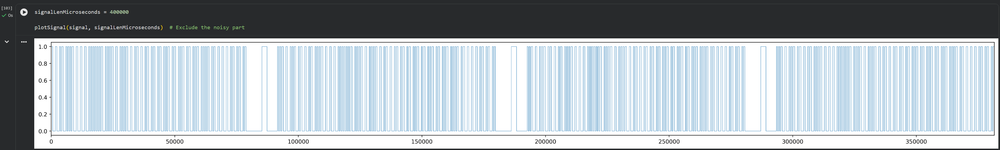
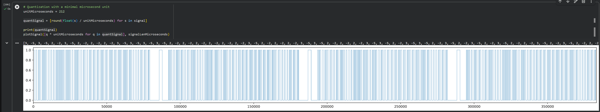
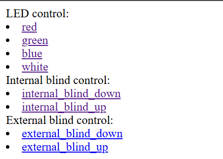

# Reverse engineering Zemismart remotes

We have a few Zemismart remotes, which use 433MHz signals for their remotes. I want to connect them to a smart home system, rather than having the 4+ remotes floating around.

This little project is me reverse engineering the remotes signal.

## 1. Flipper Zero signal capture

As the first step, I am capturing the signal using Flipper Zero. Using the Raw capture, the resulting looks like this:

```
Filetype: Flipper SubGhz RAW File
Version: 1
Frequency: 433920000
Preset: FuriHalSubGhzPresetOok650Async
Protocol: RAW
RAW_Data: 2087 -4452 385 -420 353 -414 611 -1024 589 -1046 375 -418 365 -422 579 -1032 395 -386 587 -1068 567 -1048 411 -384 597 -1042 369 -408 363 -408 397 -378 601 -1050 579 -1052 577 -1042 615 -1040 387 -390 375 -396 399 -382 369 -422 353 -414 385 -408 579 -1052 357 -422 355 -416 383 -408 579 -1050 589 -1044 375 -418 361 -420 355 -410 579 -1054 591 -1044 409 -384 595 -1040 601 -1010 415 -382 601 -1042 369 -420 589 -1040 369 -408 595 -1044 379 -378 401 -380 601 -1042 387 -396 597 -1050 381 -396 363 -420 597 -1042 367 -420 591 -1040 369 -410 365 -408 597 -1044 383 -398 363 -418 365 -420 579 -1030 397 -420 553 -1072 597 -1010 609 -1044 579 -1054 383 -396 595 -1050 381 -398 593 -1048 377 -378 601 -6798 2315 -4456 363 -418 377 -394 583 -1042 611 -1044 369 -418 361 -418 579 -1028 395 -388 587 -1072 561 -1042 407 -378 597 -1052 381 -370 389 -420 359 -420 579 -1030 593 -1044 603 -1048 575 -1052 379 -378 403 -378 401 -378 401 -378 401 -378 403 -378 599 -1042 383 -398 397 -384 367 -420 581 -1032 591 -1046 375 -420 363 -422 353 -412 577 -1056 589 -1040 373 -418 593 -1040 565 -1046 411 -382 595 -1040 369 -420 589 -1038 367 -420 587 -1042 365 -408 363 -410 593 -1050 381 -384 599 -1044 367 -418 359 -420 579 -1030 393 -388 585 -1036 397 -380 381 -414 575 -1068 365 -410 363 -408 367 -408 599 -1050 381 -368 621 -1016 609 -1044 577 -1042 613 -1040 383 -376 607 -1038 383 -376 613 -1022 385 -396 593 -6808 2301 -4454 367 -378 407 -394 585 -1046 579 -1036 397 -410 349 -416 609 -1038 367 -408 593 -1044 575 -1054 381 -368 623 -1014 409 -378 401 -378 399 -378 599 -1042 579 -1052 579 -1054 579 -1052 381 -410 373 -378 405 -378 399 -378 403 -378 399 -380 599 -1044 381 -378 403 -378 403 -378 601 -1042 581 -1050 385 -398 363 -420 365 -422 579 -1032 591 -1044 375 -418 595 -1040 597 -1014 377 -408 583 -1046 411 -382 597 -1044 365 -408 591 -1044 377 -378 401 -378 603 -1050 381 -368 619 -1050 377 -378 399 -378 599 -1050 383 -400 589 -1016 411 -384 367 -422 581 -1028 397 -380 379 -416 379 -416 573 -1062 365 -378 609 -1040 601 -1044 577 -1044 579 -1052 385 -398 593 -1050 375 -380 597 -1042 381 -190 603 -9960 187 -2318 1925 -644 1933 -2546 1955 -2724 173 -212 141 -218 141 -196 153 -184 157 -2124 387 -172 395 -176 2513 -166 4011 -206 2701 -9140 5871 -5942 1971 -2310 1931 -208 171 -596 2503 -212 131 -2576 1943 -382 1959 -386 1959 -1040 1925 -210 4067 -176 1967 -178 1927 -210 1921 -210 173 -154 1953 -1274 4063 -194 155 -390 1969 -172 6577 -360 
```

The `RAW_Data` segment contains the on/off timings in microseconds, positive for "on" signal, and negative for "off.



## 2. Visualizing in Google Collab

Using Google Collab and `Rollerblind_signal_matching.ipynb`we can visualize the signal, and crop out any noise around:

We can see that there are distinct timing "units" in the signal. In my case, quantizing the timing using 212 microsecond steps leads to a good match, but simpler signal:



## 3. Experimenting with Arduino

In the `basic_sketch.ino` we have the simplest version of mimicking the signal. Note that the microseconds quantization step and the quantized signal is pasted in; the rest of the config just sets up the pin numbers. The current setup is intended for Digispark ATtiny85, with the FS1000A board connected to pin 0.

## 4. Using Wifi actions

The `shelly_link_sketch.ino` is intended to be used with Shelly's gen3+ webhook actions and Arduino MKR WiFi 1010. The sketch includes codes 2 pairs of blinds (needs to be customized for your own values), and a simple web interface:



Each link triggers an action, and can be set up in Shelly's web interface as a custom action.